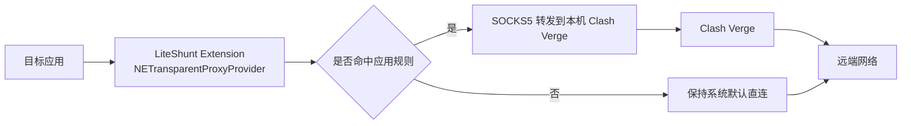

# LiteShunt

## 项目简介
LiteShunt 是一款运行在 macOS 上的轻量级 app 级流量分流工具。它的核心目标是让用户可以为指定应用单独启用代理，把命中的应用 TCP 流量转发到本机 `Clash Verge`，未命中的应用保持系统默认直连。

LiteShunt 不自研代理内核，不做节点订阅管理，不替代 `Clash Verge`。它只负责“按应用识别 + 规则匹配 + 流量转发编排 + 状态展示”这一层能力，保持产品轻量、结构清晰、易于维护。

## 目标场景
- 某些应用必须走代理，其他应用保持本地网络直连。
- 用户已经在 macOS 上使用 `Clash Verge`，希望增加“按应用精准分流”的能力。
- 需要一个菜单栏常驻、界面简洁、对系统侵入最小的辅助工具。

## 当前版本边界
- 平台：仅支持 `macOS`
- 目标系统：`macOS 14+`
- 协议范围：第一版仅支持 `TCP`
- 代理后端：第一版仅对接本机 `Clash Verge`
- 系统能力：`NetworkExtension / NETransparentProxyProvider`
- 分发场景：开发者自用或内部测试优先

## 核心架构概览
LiteShunt 采用三层最小架构：

- `LiteShuntApp`
  菜单栏宿主应用，负责规则配置、运行状态展示、启停扩展、诊断信息和共享配置写入。
- `LiteShuntExtension`
  基于 `NETransparentProxyProvider` 的透明代理扩展，负责识别来源应用、匹配规则、转发命中的 TCP 流量到本机 `Clash Verge`。
- `LiteShuntShared`
  宿主应用与扩展共享的模型、常量、错误码和配置快照定义。

## 架构链路图

## 模块职责
### 宿主应用
- 管理菜单栏状态与基础设置界面
- 维护应用规则与排除名单
- 写入共享配置快照
- 展示代理后端连通性和扩展运行状态

### 透明代理扩展
- 接收系统送入的 TCP Flow
- 识别来源应用身份
- 匹配应用规则与排除名单
- 将命中流量经 `SOCKS5` 转发到本机 `Clash Verge`
- 处理回环规避、连接失败和运行时保护

### 共享模块
- 定义 `AppRule`、`ProxyConfig`、`RuntimePolicy` 等共享模型
- 统一默认值、错误码与关键常量
- 负责配置快照的稳定序列化与反序列化

## 设计原则
- 轻量优先，不引入不必要的后台进程和重型依赖
- 官方能力优先，透明代理主线固定为 `NetworkExtension`
- 规则最小化，第一版只做应用级分流，不做域名级与脚本级策略
- 命中应用默认 `FAIL_CLOSED`，代理不可用时不自动降级直连
- 必须避免代理回环，默认排除 LiteShunt 自身与 `Clash Verge`

## 文档索引
- 技术设计文档：[`TECHNICAL_DESIGN.md`](./TECHNICAL_DESIGN.md)
- 任务与进度追踪：[`PLAN.md`](./PLAN.md)
- AI 编程指南：[`AGENTS.md`](./AGENTS.md)

## 开发路线
### 阶段一：方案固化与文档初始化
- 固化总体架构、范围边界与默认决策
- 建立项目文档体系与任务追踪机制

### 阶段二：POC 验证
- 验证 `NETransparentProxyProvider` 的按应用识别能力
- 验证命中应用到本机 `Clash Verge` 的 `SOCKS5` 转发链路
- 验证回环规避与失败策略

### 阶段三：v1 宿主应用
- 提供菜单栏 UI、应用选择、代理配置和基础诊断
- 打通宿主应用与扩展之间的共享配置

### 阶段四：稳定性完善
- 补齐核心单元测试与必要的集成验证
- 强化日志、错误处理与状态恢复能力

## 当前状态
当前已完成**核心 Swift Package 骨架**与 **`POC-001` 最小 Xcode 工程骨架**，已进入正式的 `NetworkExtension` POC 阶段。

已完成：
- 文档体系、范围边界与总体架构设计
- `LiteShuntShared` 共享模型与默认常量
- `LiteShuntCore` 中的 `FlowClassifier` 基础规则决策逻辑
- `swift build`、`swift test` 与 `swift run LiteShuntSmokeTests` 基础验证链路
- `LiteShunt.xcodeproj`、宿主应用、透明代理扩展、共享模块与测试 Target 的最小工程骨架
- `NETransparentProxyProvider` 的生命周期入口与工程级构建验证链路

尚未完成：
- 真实透明代理配置保存与扩展启停联调
- 来源应用识别与首个 TCP Flow 捕获验证
- `SOCKS5` 转发、回环规避与失败策略的系统级验证
- 完整菜单栏 UI、规则管理与热加载链路

当前最优先的下一步是：**进入 `POC-002`，在真实扩展配置下验证来源应用识别与首个 TCP Flow 捕获。**
